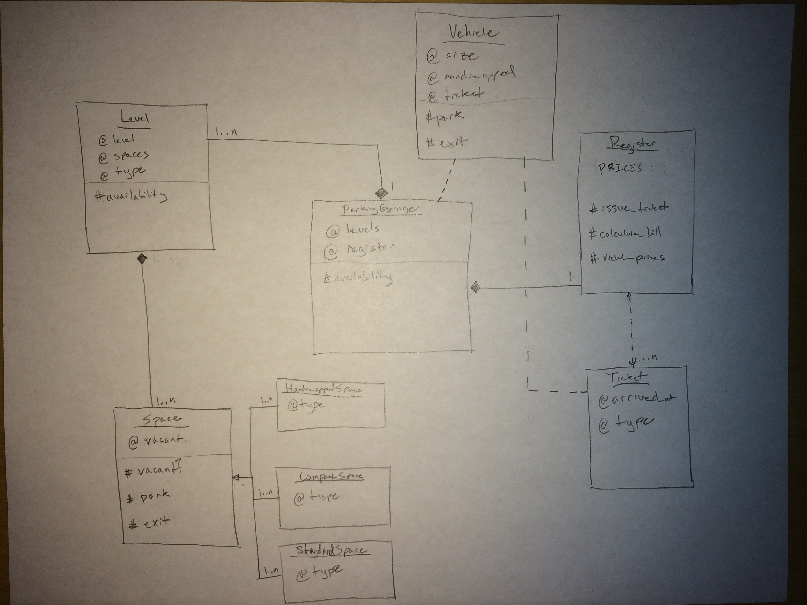

# Parking_garage
By [Scott Macpherson](https://github.com/scottmacphersonmusic)
### Description
**parking_garage** is an object-oriented model of a parking garage.
### Approach
Initialize a new parking garage:
```ruby
garage = ParkingGarage.new
```
This will generate 5 new `Level` objects and a `Register` object.  The register is responsible for issuing `Ticket` objects and calculating the price of parking for various amounts of time.  When a `Level` is instantiated it generates 100 parking spaces:
- 5 `HandicappedSpace` objects
- 45 `CompactSpace` objects
- 50 `StandardSpace` objects

which all inherit from `Space`.

The parking garage is now aware of `Vehicle` objects.  A vehicle has instance attributes:
- `@size`
  - *[compact or standard]*
- `@handicapped`
  - *a boolean*
- `@ticket`
  - *vehicles MUST have a ticket*

If space is available, a `Vehicle` will be assigned to a `Space` corresponding to its `@size` and `@handicapped` attributes.  It has methods `#park` and `#exit`, which correspond to methods of the same name on `Space` objects and are used to update the `@vacancy` attribute of a given `Space`.
### UML Diagram

